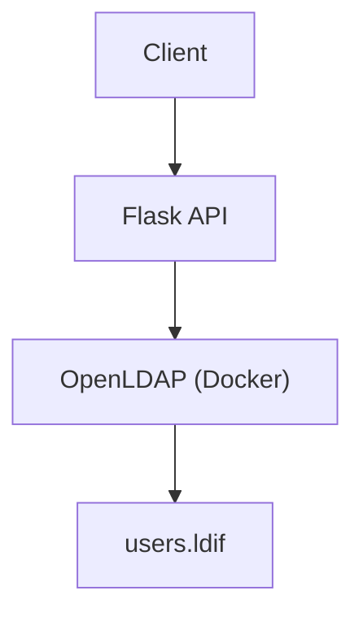

/!\ Projet en cours

# Projet 

J'ai fait un système d'authentification avec un service API , qui agit comme le point d'entrée intermédiaire à l'authentification d'un utilisateur quelconque et une base utilisateurs avec LDAP.

L'application AccessChecker permet de vérifier ce qui rentre, l'authentification et l'autorisation.

# Architecture

J'ai réalisé ce 1er projet en local qui implémente un Reverse proxy, point d'entrée et pilier de l'archicture.

Il permet de :

* protèger les services internes
* appliquer des règles de sécurité (TLS, WAF...)
* séparer **exposition réseau**

.

 Dans ce cas précis, le client fait une requête, qui passe par le service Flask que le proxy redirige vers l'annuaire.

##Sources
 [freeCodeCamp.org](https://www.youtube.com/watch?v=9t9Mp0BGnyI)
