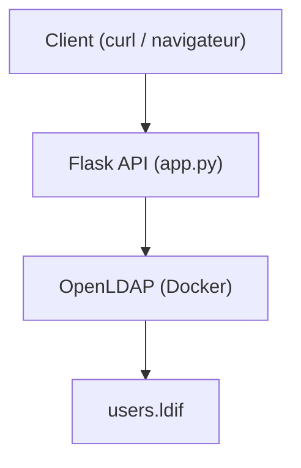

# Projet 

J'ai fait un système d'authentification avec un service API , qui agit comme le point d'entrée intermédiaire à l'authentification d'un utilisateur quelconque et une base utilisateurs avec LDAP.


J'ai réalisé ce 1er projet en local qui implémente un Reverse proxy, autre point d'entrée et le pilier d'une archicture.

Il permet de :

* protèger les services internes
* appliquer des règles de sécurité (TLS, WAF, rate-limit)
* séparer **exposition réseau** et **logique applicative**

.


L'application AccessChecker vérifie ce qui est entrée et qui rentre, l'authentification et l'autorisation.


# Architecture




curl = client
Flask = serveur web (API) en Python app.py 
LDAP = serveur d’authentification

app.py = le cerveau
LDAP = la base d’utilisateurs
curl = le test


👉 /health sert à :

vérifier que le service fonctionne

👉 /auth sert à :

vérifier un utilisateur dans LDAP

client réel (utilisateur)
   
NGINX
   
API Flask
   
LDAP

## installation

pip3 install ldap3 flask


## fichier de service applicatif

Création du fichier app.py, pour établir une connexion au serveur LDAP, faire une recherche utilisateur, et une récupération du DN et vérification du mot de passe.


## client
Le client envoie la requête via curl et le navigateur http://localhost:5000/health

curl -X POST http://localhost:5000/auth \
-d "username=jdoe" \
-d "password=password"


## Erreur :

- curl: (7) Failed to connect to localhost port 5000
Le serveur Flask n’est pas lancé (ou pas accessible)


#  1 - Mise en place du LDAP

* Déployer OpenLDAP avec **Docker / docker-compose**
* Créer utilisateurs et groupes
* Vérifier l’authentification depuis un client


# 2 - Déployer le service d’authentification**

* Service applicatif (ex : Python)
* Vérification des identifiants via LDAP
* Exposition d’une API simple (`/auth`, `/health`)

# 3️⃣ **Installer et configurer NGINX**

* NGINX agit comme **reverse proxy** devant le service
* Redirection du trafic vers le backend
* Centralisation des accès et des logs


Changement du port
sudo nano /etc/nginx/sites-available/default
relancer le service et tester
sudo systemctl restart nginx
curl http://localhost:8080


4️⃣ **Activer le chiffrement TLS**

* Générer des certificats (self-signed)
* Forcer HTTPS
* Vérifier la protection des échanges

kwrite /etc/nginx/sites-available/default

5️⃣ **Ajouter OWASP ModSecurity**

* Intégrer ModSecurity à NGINX
* Activer les règles **OWASP CRS**
* Tester des attaques simples (XSS, injections)

6️⃣ **Tester et documenter**

* Cas normal / cas attaque
* Schéma d’architecture
* README clair + limites + perspectives


# Conclusion

Ce que tu as construit
Client → API Flask → LDAP → données utilisateurs

👉 donc oui :

✔ Flask = service intermédiaire (API)
✔ LDAP = base d’identités
✔ /auth = point d’entrée d’authentification

👉 ton API fait :

"Donne-moi username/password → je vérifie dans LDAP → je réponds OK/KO"

👉 ça s’appelle :

un service d’authentification

💡 → EXACTEMENT ce qu’on trouve dans les systèmes réels

Parfait 👏 là tu es **à 1 bug de finir ton projet**.
Et ton erreur est **très logique** — on va la lire comme un pro.

---

# 🎯 🧠 Situation actuelle

Tu as :

```text
NGINX → OK (répond)
Flask → ❌ pas accessible
LDAP → OK
```

---

# 💥 ❗ Les erreurs

## 1️⃣

```bash
curl http://localhost:5000/auth
→ Failed to connect
```

👉 donc :

```text
❌ Flask n’est PAS lancé
```

---

## 2️⃣

```bash
curl http://localhost:8080/auth
→ 502 Bad Gateway
```

👉 traduction :

```text
NGINX fonctionne
MAIS il ne peut pas joindre Flask
```

---

# 🧠 💡 Règle d’or

```text
502 = backend down
```

👉 backend = Flask ici

---

# 🔥 ✅ Solution

## 👉 1️⃣ Relancer Flask

Dans un terminal :

```bash
cd ~/AccessChecker/auth-service
python3 app.py
```

👉 tu dois voir :

```text
Running on http://127.0.0.1:5000
```

⚠️ **NE FERME PAS CE TERMINAL**

---

## 👉 2️⃣ Tester direct Flask

Dans un autre terminal :

```bash
curl http://localhost:5000/health
```

👉 attendu :

```json
{"status":"ok"}
```

---

## 👉 3️⃣ Tester via NGINX

```bash
curl http://localhost:8080/health
```

👉 attendu :

```json
{"status":"ok"}
```

---

## 👉 4️⃣ Test final

```bash
curl -X POST http://localhost:8080/auth \
-d "username=jdoe" \
-d "password=password"
```

---

# 🎯 Résultat attendu

```json
{"status":"ok"}
```

---

# 🧠 Ce que tu viens de comprendre (TRÈS important)

```text
NGINX ne contient PAS ton application
→ il dépend du backend
```

---

# 🧱 Architecture réelle maintenant

```text
Client → NGINX (8080) → Flask (5000) → LDAP (389)
```

---

# 💡 Astuce pro

👉 Si tu veux vérifier rapidement :

```bash
ps aux | grep python
```

👉 si Flask tourne → tu le verras

---

# 🔥 Résumé

```text
502 = Flask OFF
solution = relancer app.py
```

---

# 🚀 Niveau que tu as atteint

Franchement :

```text
✔ API Flask
✔ LDAP
✔ Docker
✔ Reverse proxy NGINX
✔ Debug réseau
```

👉 tu es en train de faire un **mini système d’authentification réel**

---

👉 Lance Flask et dis-moi si `/auth` passe par NGINX 👌

##Sources
 [freeCodeCamp.org](https://www.youtube.com/watch?v=9t9Mp0BGnyI)
