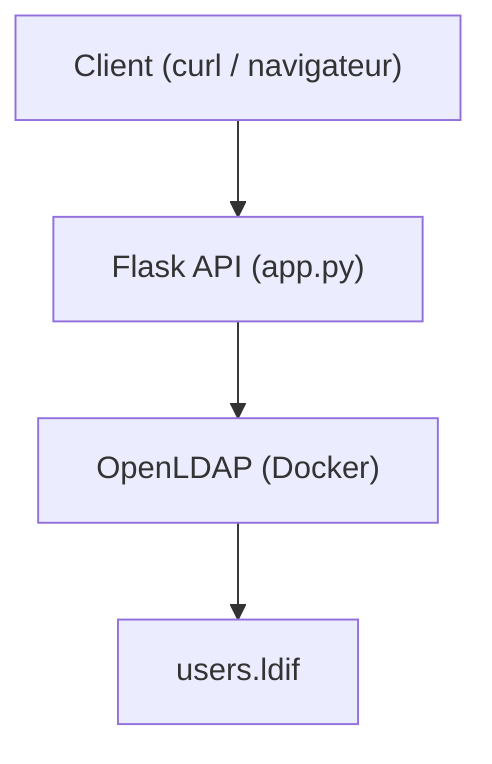
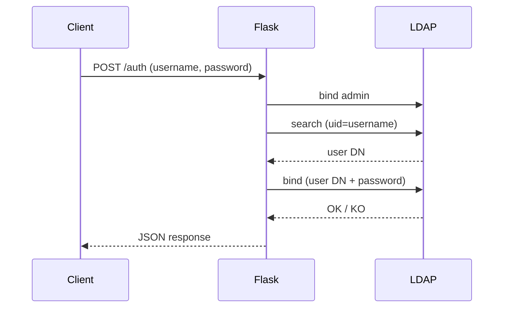
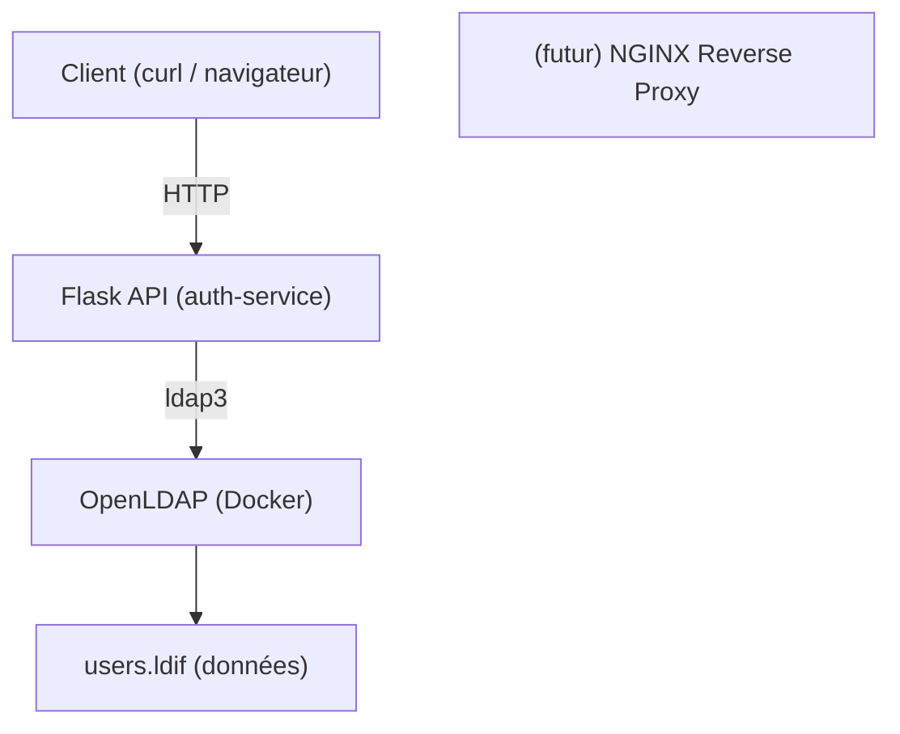

Parfait 🔥 on va faire ça **propre en Mermaid.js**, comme dans un vrai README GitHub.

---

# 🧱 🔹 Diagramme simple (à comprendre)



---

# 🔍 🔹 Diagramme avec flux d’authentification



---

# 🧠 🔹 Version plus complète (niveau projet)



---

# 🔥 🔹 Version “propre README” (recommandée)

```mermaid
flowchart LR
    A[Client] -->|POST /auth| B[Flask API]
    B -->|Bind admin| C[LDAP Server]
    B -->|Search user| C
    B -->|Bind user| C
    C -->|Check credentials| D[Directory (LDIF)]
    C --> B
    B -->|JSON response| A
```

---

# 🎯 Astuce GitHub

👉 Pour que ça marche :

* Mets ça dans ton `README.md`
* GitHub affiche automatiquement les diagrammes Mermaid

---

# 🚀 Si tu veux aller plus loin

Je peux te faire la version finale avec :

* NGINX (reverse proxy)
* TLS (HTTPS)
* ModSecurity (WAF)

👉 Là tu auras un **schéma niveau ingénieur cyber / DevSecOps** 💀


Parfait 👀 là on a **l’erreur exacte**, et tu viens de toucher un vrai problème d’infra (très formateur 🔥).

---

# 💥 ❗ Le problème

Dans tes logs :

```text
sed: can't read ... tls-enable.ldif: No such file or directory
ERROR | slapd failed
```

👉 Traduction :

```text
❌ LDAP a crash au démarrage
```

Donc :

```text
docker → conteneur lancé
MAIS
LDAP → ne démarre pas → port 389 fermé
→ ldapsearch échoue
→ /auth échoue
```

---

# 🧠 Pourquoi ça arrive

👉 À cause de ton volume :

```yaml
volumes:
  - ./ldap:/container/service/slapd/assets/config/bootstrap/ldif/custom
```

👉 Ton dossier `ldap/` **remplace partiellement la config interne**

👉 Résultat :

```text
LDAP cherche ses fichiers internes → ne les trouve plus → crash
```

---

# ✅ Solution SIMPLE (recommandée)

## 🔥 1️⃣ Reset propre

```bash
docker compose down -v
```

---

## 🔥 2️⃣ Modifier ton `docker-compose.yml`

👉 Remplace :

```yaml
volumes:
  - ./ldap:/container/service/slapd/assets/config/bootstrap/ldif/custom
```

👉 par :

```yaml
volumes:
  - ./ldap:/container/service/slapd/assets/config/bootstrap/ldif
```

---

## 🔥 3️⃣ Relancer

```bash
docker compose up -d
```

---

## ⏳ 4️⃣ Attendre 10 secondes

---

## 🧪 5️⃣ Tester LDAP

```bash
ldapsearch -x \
-H ldap://localhost:389 \
-D "cn=admin,dc=access,dc=local" \
-w ad123 \
-b "dc=access,dc=local"
```

---

# 🎯 Pourquoi ça marche

👉 Tu remets la structure attendue par OpenLDAP

👉 Donc :

```text
LDAP démarre correctement
→ charge ton users.ldif
→ devient accessible
```

---

# 🧠 Ce que tu viens d’apprendre (très important)

```text
Docker volume mal configuré = service cassé
```

C’est **ULTRA courant en DevOps / cyber**.

---

# 🚀 Après ça

Quand `ldapsearch` marche :

👉 relance ton Flask (si besoin)

```bash
python3 app.py
```

Puis :

```bash
curl -X POST http://localhost:5000/auth \
-d "username=jdoe" \
-d "password=password"
```

---

# 🎉 Résultat attendu

```json
{"status": "ok"}
```

---

# 🧠 Résumé clair

```text
problème = LDAP crash à cause du volume
solution = corriger le chemin + reset docker
```

---

💡 Envoie-moi le résultat de `ldapsearch` après correction — on valide tout ton système 🔐 (tu es à 1 étape de finir ton étape 1).
